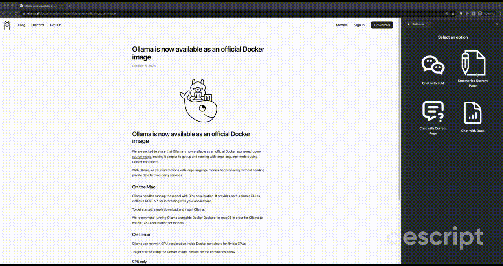

# DistiLlama

## What is DistiLlama?

DistiLlama is a Chrome extension that leverages locally running LLM perform following  tasks.

One of the things that I was experimenting with is how to use a locally running LLM instance for various tasks and summarization (tl;dr) was on the top of my list. It was key to have all calls to LLM be local and all the data to stay private.

This project utilizes [Ollama](https://ollama.ai/) as the locally running LLM instance. Ollama is a great project that is easy to setup and use. I highly recommend checking it out.

To generate the summary I am using the following approach:

- Grab the current active tab id
- Use [Readability](https://github.com/mozilla/readability) to extract the text content from the page. In my experiments it was clear that the quality of the summary was much better when using Readability as it removed a lot of un-necessary content from the page.
- Use [LangChain (LangChain.js)](https://js.langchain.com/docs/get_started/introduction/) to summarize the text content.
- Display the summary in a popup window.

## How to use DistiLlama?

- Prerequisites:
  - Install [Ollama](https://ollama.ai/download) you can also choose to run Ollama in a [Docker container](https://ollama.ai/blog/ollama-is-now-available-as-an-official-docker-image).
  - Start Ollama using the following command: `OLLAMA_ORIGINS=* OLLAMA_HOST=127.0.0.1:11435 ollama serve`
  - In another terminal you can run `ollama pull llama2:latest` or `ollama pull mistral:latest`
  - Choice of model depends on your use case. Here are the models supported by Ollama <https://ollama.ai/library>
  - `OLLAMA_ORIGINS=*` is important as it will not block traffic from the extension.

- Clone this repo
  - Install pnpm `npm install -g pnpm`
  - run `yarn install`
  - run `yarn dev`
  - Open Chrome and navigate to `chrome://extensions/`
    - Enable developer mode (if not already enabled)
    - Click on `Load unpacked` and select the `dist` folder from the base of the cloned project.
    - You should see the DistiLlama added to your Chrome extensions.
    - You may want to pin the extension to your Chrome toolbar for easy access.

## Demo

### Chat with LLM

### Chat with Documents (PDF)

### Chat with Web Page

### Summarization

## TODOS

- [ ] Make the summarization chain configurable
- [x] Make LLM model configurable
- [ ] Save summary in local storage
- [ ] Improve the UI (not an expert in this area but will try to learn)
- [ ] Add TTS support
- [ ] Check out performance with different tuned prompts
- [x] Extend to chat with the page (use embeddings and LLMs for RAG)
- [x] Use [transformers.js](https://github.com/xenova/transformers.js) for local in browser embeddings and [Voy](https://github.com/tantaraio/voy) for the storage similar to this [Building LLM-Powered Web Apps with Client-Side Technology](https://ollama.ai/blog/building-llm-powered-web-apps)
- [ ] Focus on improving the quality of the summarization and chat
- [ ] Multimodal support 

## References and Inspiration

- [LangChain](https://github.com/langchain-ai/langchainjs)
- [Ollama](https://ollama.ai/)
- [Building LLM-Powered Web Apps with Client-Side Technology](https://ollama.ai/blog/building-llm-powered-web-apps)
- [Chrome Extension Template](https://github.com/Jonghakseo/chrome-extension-boilerplate-react-vite)
- Artwork generated using [DALL·E 3](https://openai.com/dall-e-3)
